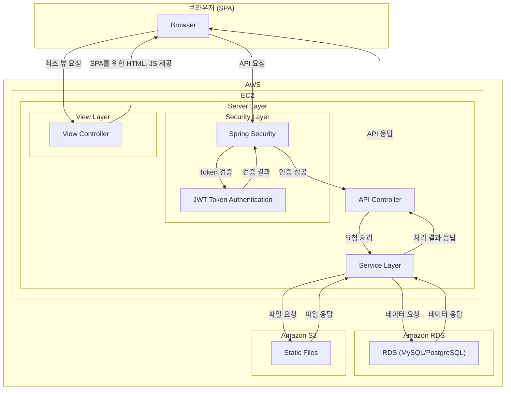

---
# SoundBrew  
> **회원/구독제 음원 판매 사이트**
---

## 목차
1. [프로젝트 소개]
2. [프로젝트 배경]
3. [프로젝트 참여 인원]
4. [주요 구현 기능]
5. [사용 기술]
    - [백엔드]
    - [프론트엔드]
    - [데이터베이스]
    - [AWS]
6. [시스템 구조]
7. [데이터베이스 구조]
8. [프로젝트 구조]
9. [추후 개발 방향]
10. [프로젝트 미리보기]
11. [추가 링크]

---

## 프로젝트 소개
"내가 만든 음원을 손쉽게 찾고, 간편하게 업로드하고, 사람들에게 들려줄 수 있다면?"

이 단순한 아이디어에서 프로젝트가 시작되었습니다.  
팀원 전원이 **실용음악과 출신**으로, 직접 **음원 공유 사이트를 만들어 보고 싶다**는 목표를 가지고 주제를 선정했습니다.  

이 프로젝트에서는 **RESTful API를 최대한 준수**하여,  
- **서버는 API 제공에 집중**하고  
- **클라이언트는 UI 렌더링을 전담**하는 **SPA 방식**을 채택하는 것을 목표로 하였습니다.  


<br>

<a href="https://www.notion.so/leeinwon/SoundBrew-1aea7464bbfc80ec84f0d3b7c0a5a991">
  
  SoundBrew 프로젝트 통합 기술문서 확인하기
</a>

<br>
<br>

<a href="http://soundvbrew-env.eba-gpmigkef.ap-northeast-2.elasticbeanstalk.com/sounds/tracks">
  
  SoundBrew 프로젝트 웹 페이지 확인하기
</a>

테스트 계정 : inwon.private@gmail.com
테스트 계정비밀번호 : testTEST123!@#

## 프로젝트 배경
현실적인 개발 환경을 고려하여 **설계, 개발, 유지보수** 등 다양한 부분을 체계적으로 진행하며, "실제 회사에서 프로젝트를 한다면?"이라는 관점에서 접근하였습니다.

---

## 프로젝트 참여 인원
| 이인원                                | 경동훈                               |
|--------------------------------------|--------------------------------------|
|  |  |
| **역할**: Backend/Front 개발          | **역할**: Backend/Front 개발         |
| **연락처**: inwon.private@icloud.com  | **연락처**: ddjsj12@naver.com         |
| **깃허브**: [leein1](https://github.com/leein1)   | **깃허브**: [kyoungdonghun](https://github.com/kyoungdonghun) |

---

## 주요 구현 기능

### 🎼 음원 관리
- 음악 업로드 및 태깅
- 파일 저장 및 관리 (AWS S3 활용)
- 앨범 및 패키지 구성

### 🔍 음원 검색 및 필터링
- 태그 기반 검색 (Mood, Genre, Instrument 등)
- QueryDSL을 활용한 검색
- 키워드 및 필터링 시스템 적용

### 🔐 인증 및 보안
- JWT 기반 인증 및 보안 정책
- 토큰 발급 및 만료 처리
- API 및 데이터 권한 관리

### 📡 API 및 데이터 처리
- RESTful API 설계 및 문서화
- DTO 기반 요청/응답 표준화
- JPA 및 집계 함수 활용

### 🛠 운영 및 배포
- 서버 배포 및 유지보수 (AWS 활용)
- 에러 로깅 및 예외 처리 전략

### 🎨 프론트엔드 개발 및 UX/UI
- SPA 방식 적용
- 비동기 데이터 처리 및 상태 관리
- 사용자 입력 처리 및 표준화

## 🔄 **추후 개발 방향 (업데이트 시 최신화)**

**장바구니 및 결제 기능**  
  - 정기 구독제 및 크레딧 시스템  
  - 주문 및 결제 이력 관리  
  - 구매 및 구독 시스템

---

## 사용 기술

### 백엔드
<span>
    
    
    
    
</span>

### 프론트엔드
<span>
    
    
    
    
</span>

### 데이터베이스


### AWS
<span>
    
    
    
</span>

---

## 시스템 구조



---

## 데이터베이스 구조


---

## 프로젝트 구조

```plaintext
src/
└── main/
    ├── java/
    │   └── com.soundbrew.soundbrew/
    │       ├── config/
    │       ├── controller/
    │       ├── domain/
    │       ├── dto/
    │       ├── handler/
    │       ├── repository/
    │       ├── security/
    │       ├── service/
    │       ├── util/
    │       └── SoundBrewApplication
    └── resources/
        ├── static/
        ├── templates/
        ├── application.yml
        ├── application-dev.yml
        └── application-prod.yml
```

## 프로젝트 미리보기

###     [더 다양한 페이지 보기](https://leeinwon.notion.site/1baa7464bbfc80c1ac0bd231770f1ec3?pvs=74)


### 1. 메인화면 (Desktop)


### 2. 메인화면 (Mobile)


### 3. 회원등록 (Desktop)


### 4. 통계 (Desktop)


---
