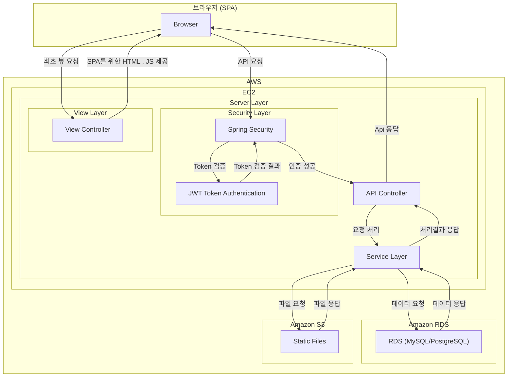

# SoundBrew

## 📝 프로젝트 소개
 
회원/구독제 음원 판매 사이트 
 
 

### 프로젝트 배경
 
팀원 전부 실용음악과 출신으로, 음원 공유 사이트를 만들어 보고 싶다는 목표로 주제를 정하게 되었습니다. 
REST를 최대한 준수하는것이 목표였으며, '실제 회사에서 프로젝트를 한다면 어떻게 진행할까' 를 중점으로 개발하였습니다.
 
 

### 프로젝트 참여 인원
 
이인원 경동흔 각 주소 
사진도 좋을듯 번호라던가 메일이라던가 
 
 

## 관련 문서
 
https://leeinwon.notion.site/3-1aea7464bbfc80ec84f0d3b7c0a5a991
 
 

## 🛠 사용 기술
- Spring Boot 2.7.18
- SpringSecurity
- JWT
- MySql
- thymeleaf
- Axios
- SPA

## 📊 시스템 구조
 

## 🔍 주요 기능( 좀 더 자세히x -> 적절한 단어 찾아봐야 할듯)
1. 회원 관리
   - JWT 기반 인증
   - OAuth2.0 소셜 로그인

2. 음원 관리
   - 앨범 
   - 음원

3. 음원 재생
4. 파일 업/다운로드
5. 구독 결제

## 🎯 요약
사이트 사진이라던가 주요 기능들 스크린샷 너무 많이 x

