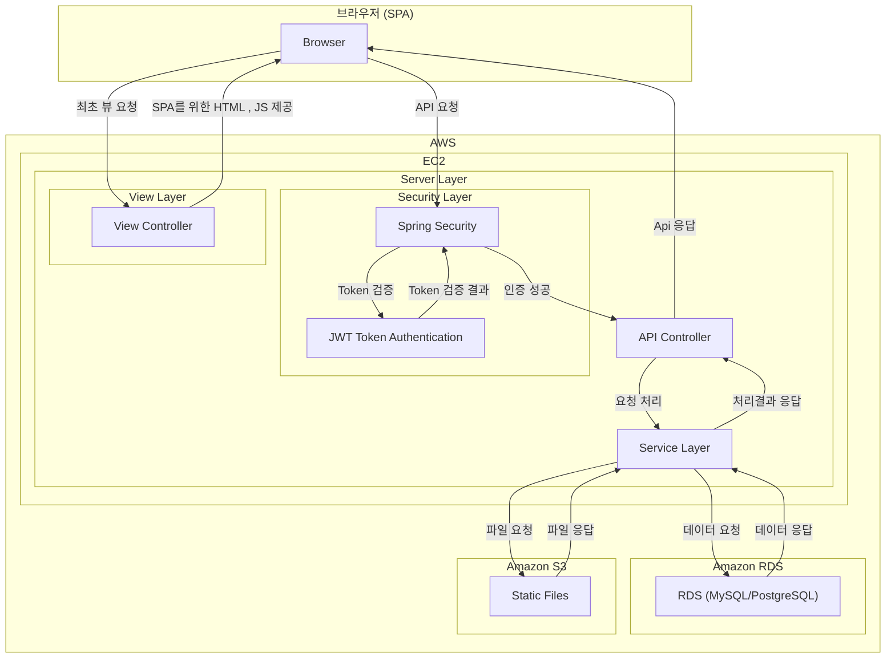

# SoundBrew

## 📝 프로젝트 소개
<br>
회원/구독제 음원 판매 사이트 
<br>
<br>

### 프로젝트 배경
<br>
팀원 전부 실용음악과 출신으로, 음원 공유 사이트를 만들어 보고 싶다는 목표로 주제를 정하게 되었습니다.<br>
REST를 최대한 준수하는것이 목표였으며, '실제 회사에서 프로젝트를 한다면 어떻게 진행할까' 를 중점으로 개발하였습니다.
<br>
<br>

### 프로젝트 참여 인원
<br>
이인원 경동흔 각 주소<br>
사진도 좋을듯 번호라던가 메일이라던가 
<br>
<br>

## 상세 문서
<br>
아래는 Notion으로 작성한 프로젝트 전반에 대한 상세 문서 링크 입니다.<br>
<br>
https://leeinwon.notion.site/3-1aea7464bbfc80ec84f0d3b7c0a5a991
<br>
<br>

## 🛠 사용 기술

<span>


</span>
<br>
<span>


</span>
<br>
<span>


</span>
<br>
<span>

</span>
<br>

## 📊 시스템 구조
<br>


<br>

## 데이터베이스 구조

사진 첨부

## 프로젝트 구조

```plaintext
src/
└── main/
    ├── java/
    │   └── com.soundbrew.soundbrew/
    │       ├── config/
    │       ├── controller/
    │       ├── domain/
    │       ├── dto/
    │       ├── handler/
    │       ├── repository/
    │       ├── security/
    │       ├── service/
    │       ├── util/
    │       └── SoundBrewApplication
    └── resources/
        ├── static/
        ├── templates/
        ├── application.yml
        ├── application-dev.yml
        └── application-prod.yml
```

## 🔍 주요 기능( 좀 더 자세히x -> 적절한 단어 찾아봐야 할듯)
1. 회원 관리
   - JWT 기반 인증
   - OAuth2.0 소셜 로그인

2. 음원 관리
   - 앨범 
   - 음원

3. 음원 재생
4. 파일 업/다운로드
5. 구독 결제

## 🎯 요약
사이트 사진이라던가 주요 기능들 스크린샷 너무 많이 x

